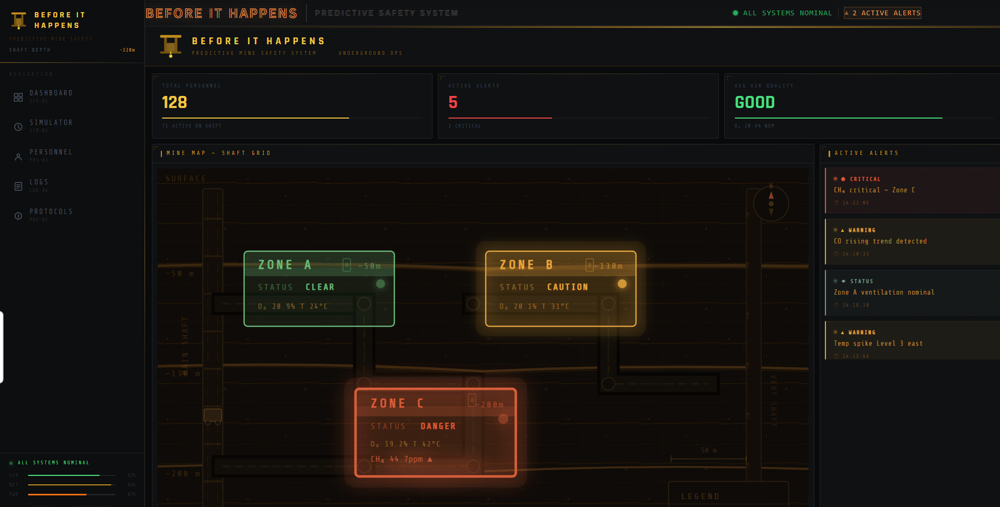
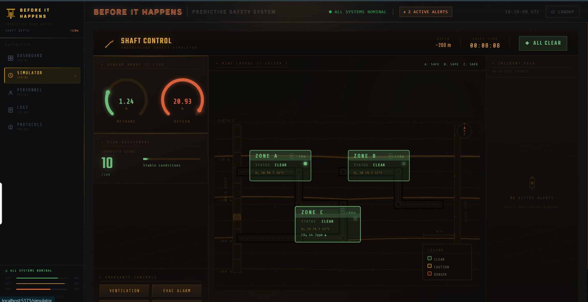
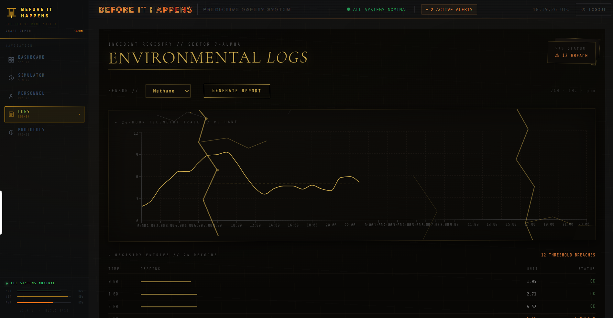
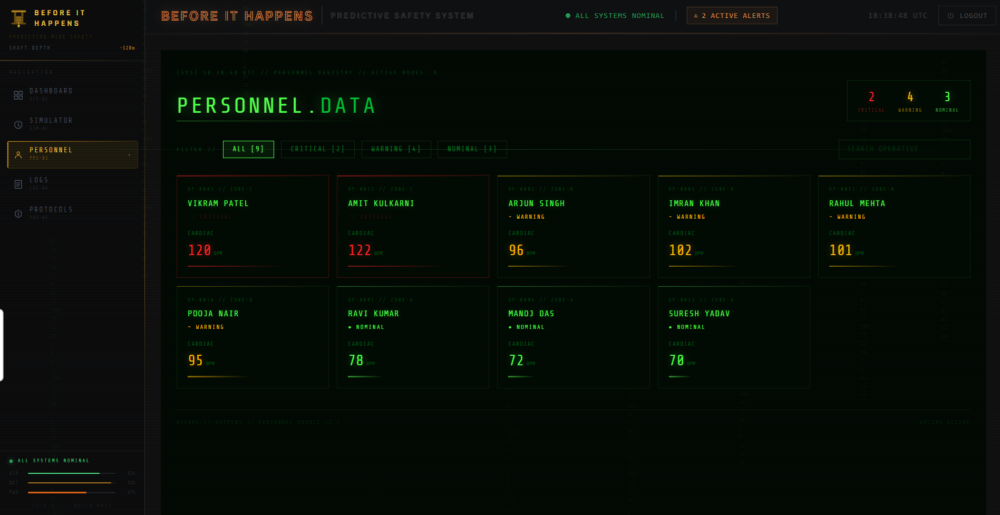
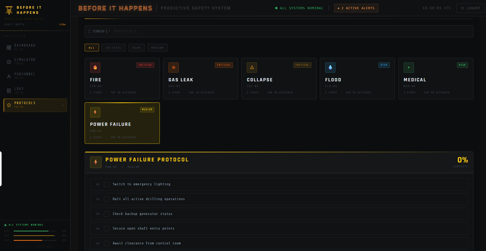

# 🚀 Before It Happens
# 🚀 Predictive Mining Simulation Project
## 🎯 Problem Statement
Mining environments are highly dangerous, where small failures can lead to major accidents. This project uses AI to predict potential failures early and improve safety.

## 💡 Solution
We simulate industrial conditions and use AI models to detect risk patterns and generate early warnings.

## 📊 Dashboard
The dashboard provides a real-time overview of system conditions and risk levels.



---

## ⚙️ Simulation
The simulation predicts potential failures based on sensor inputs.



---

## 📜 Logs & Monitoring
Logs help track system behavior and detect anomalies.



---

## 👷 Personnel Management
Manages worker data and safety status.



---

## 📋 Safety Protocols
Displays recommended actions during high-risk scenarios.



### Predict risks before they turn into disasters.

A **predictive safety simulation system** that models hazardous environments and shows how *delayed human response increases risk in real time*.

---

## 🎥 Demo
🔗 Live: https://befor-it-happens.vercel.app/  
🎬 Video: https://drive.google.com/file/d/1PPTypoYoOXSYJO-ci3KsM1RZCziofyDp/view

---

## 🧠 The Idea

Most systems react **after danger occurs**.

**Before It Happens** focuses on:
- Predicting risk buildup 📈  
- Simulating real-world hazardous scenarios ⚠️  
- Showing how *reaction time directly affects safety* ⏱️  

---

## ✨ Key Highlights

### ⏱️ Human Reaction Tracker (Core Innovation)
- Measures delay between alert and user response  
- Calculates how delay increases risk  
- Demonstrates *why timing matters in safety systems*  

---

### 🔮 Predictive Risk Engine
- Real-time risk score (0–100)  
- Future danger prediction  
- Alerts like:
  - “Risk rising”
  - “Danger likely in X seconds”

---

### 🎥 Simulation System
- Models Methane, Oxygen, Temperature  
- Scenario-based events (e.g., gas leak)  
- Realistic gradual changes  

---

### 📊 Final Safety Report
- Reaction time vs ideal response  
- Risk increase due to delay  
- Clear outcome analysis  

---

### 🧭 Command Center Dashboard
- Zone-based risk visualization  
- Air quality + personnel monitoring  
- Centralized control interface  

---

## 🛠️ Tech Stack
- **Frontend:** React (Vite), Tailwind CSS  
- **State:** Context API, Hooks  
- **Animations:** Framer Motion  
- **Backend:** Firebase Auth + Firestore  

---

## ⚙️ Run Locally

```bash
git clone https://github.com/prachi-ps007/Befor_It_Happens.git
cd Befor_It_Happens
npm install
npm run dev
